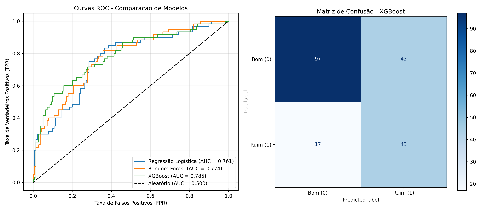
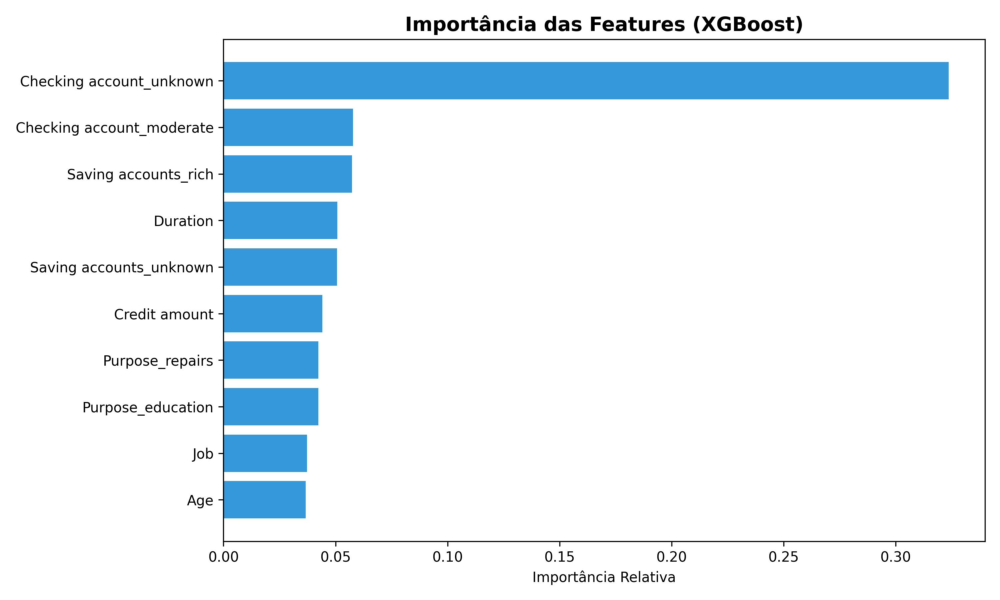
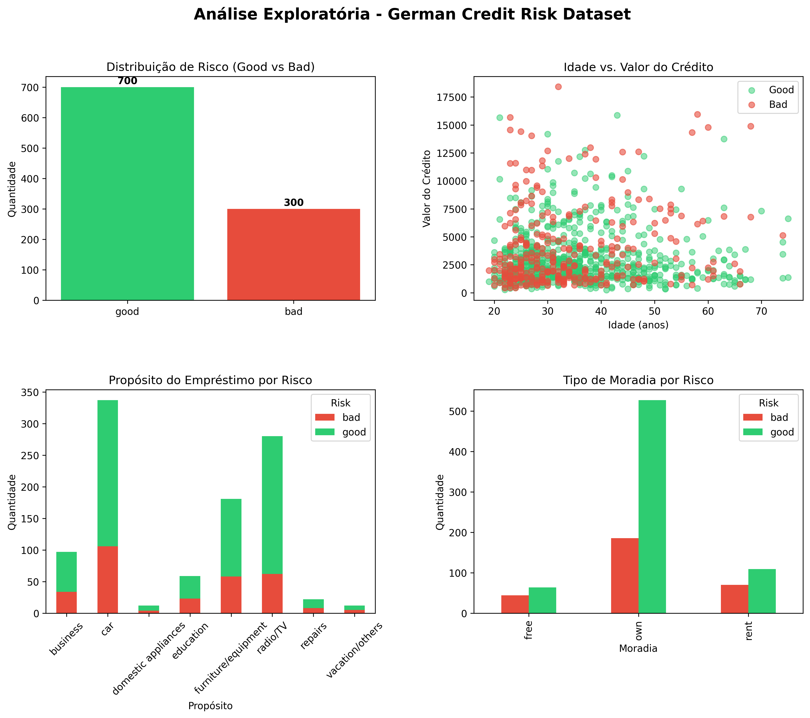

# Projeto-Credit-Risk

<div align="center">

  
  
  
  

</div>

<p align="center">
  <strong>Plataforma de avaliação de risco de crédito com Machine Learning, API e dashboard.</strong>
</p>

## Visão geral

Este repositório implementa um pipeline completo para avaliação de risco de crédito usando o dataset alemão de crédito. A solução combina análise exploratória, pré-processamento, treinamento de modelos, explicabilidade e uma interface para uso prático em ambiente de decisão financeira.

O projeto foi pensado para demonstrar um fluxo realista de ML em produção, incluindo:

- análise exploratória de dados (EDA)
- tratamento de variáveis e encoding
- comparação de modelos de classificação
- métricas de negócio e performance
- inferência em novas propostas de crédito
- API REST e dashboard para visualização

## Stack principal

- Python
- Pandas
- Scikit-learn
- XGBoost
- Matplotlib / Seaborn
- FastAPI
- Streamlit / Dash
- Docker

### Principais entregáveis

- EDA com análise estatística e visual
- comparativo de modelos de classificação
- explicabilidade de predição por feature impact
- monitoramento de estabilidade com PSI
- API REST para avaliação de crédito
- dashboard para apoio à decisão

## Métricas do modelo

Os modelos avaliados foram Regressão Logística, Random Forest e XGBoost. O melhor desempenho ficou com o XGBoost, conforme métrica de ROC-AUC e recall para maus pagadores.

| Modelo | ROC-AUC | Recall (maus pagadores) |
|---|---:|---:|
| XGBoost | 0.7850 | 71.67% |
| Random Forest | 0.7739 | - |
| Regressão Logística | 0.7607 | - |

## Arquitetura do projeto

```text
Projeto Credit Risk/
├── german_credit_data.csv          # Dataset original
├── eda.py                          # Análise exploratória de dados
├── predict.py                      # Simulação e inferência em novos perfis
├── requirements.txt                # Dependências do projeto
├── Dockerfile                      # Container da aplicação
├── docker-compose.yml              # Orquestração dos serviços
├── README.md                       # Documentação do projeto
├── LICENSE                         # Licença do projeto
├── .gitignore                      # Arquivos ignorados pelo Git
├── models/
│   └── credit_risk_model.joblib   # Modelo treinado + preprocessador
├── plots/
│   ├── eda_overview.png            # Gráficos de EDA
│   ├── model_evaluation.png        # ROC e matriz de confusão
│   └── feature_importance.png      # Importância das features
├── src/
│   ├── preprocessing.py           # Pipeline de preprocessamento
│   ├── train_model.py             # Treinamento, validação e salvamento
│   ├── monitoring.py              # Monitoramento de estabilidade
│   └── risk_engine.py             # Motor de risco e decisões
├── app/
│   ├── api.py                     # API de inferência
│   └── dashboard.py               # Dashboard interativo
└── .agents/
    └── skills/
```

## Capturas e explicação das telas

Abaixo estão os principais painéis do projeto e o que cada um representa na solução de risco de crédito.

### 1. Resultado da análise de risco

A primeira tela mostra o score final do cliente, a faixa de decisão, o valor de pontuação e os indicadores principais de risco. Ela centraliza a decisão final: se o cliente está em zona de aprovação, atenção ou risco elevado.

<div align="center">
  
</div>

- score geral do cliente
- classificação de decisão (aprovado, atenção ou risco)
- indicadores de crédito e exposição
- visão rápida para tomada de decisão de negócio

### 2. Explicabilidade do modelo (SHAP)

A segunda tela destaca os fatores que mais aumentam ou reduzem o risco do cliente. Esse gráfico é importante porque mostra, de forma interpretável, por que a predição foi feita.

<div align="center">
  
</div>

- variáveis com impacto positivo e negativo sobre o risco
- exemplo de fatores como duração do crédito, housing, checking account e credit amount
- apoio para análise de negócio e conformidade

### 3. EDA e análise exploratória

A terceira etapa mostra a distribuição dos dados, a relação entre idade e valor do crédito, e a comparação por categoria de risco. Essa tela ajuda a entender a base e detectar padrões antes do treinamento do modelo.

<div align="center">
  
</div>

- distribuição de bons e maus pagadores
- relação entre idade e valor do crédito
- comportamento por tipo de propósito do empréstimo
- análise visual da base e dos padrões de risco

### 4. Monitoramento de estabilidade (PSI)

Essa tela avalia se a distribuição dos scores está estável em relação à base de treinamento. Ela mostra se o modelo continua confiável ou se precisa de retraining.

- PSI como indicador de estabilidade
- status: estável, atenção ou crítico
- comparação entre treino e nova safra
- sinalização para manutenção do modelo em produção

### 5. API de avaliação de risco

A última parte mostra a interface da API para chamar o modelo em produção. Ela expõe endpoints para:

- avaliação de crédito de um cliente
- cálculo de PSI para monitoramento populacional
- documentação interativa dos modelos

Essas telas deixam claro que o projeto não é apenas um modelo em notebook: é um fluxo real de produto de risco de crédito, com visão analítica, explicabilidade, monitoramento e integração via API.

## Como executar

### 1. Clonar o repositório

```bash
git clone git@github.com:felipedhesantana-debug/Projeto-Credit-Risk.git
cd Projeto-Credit-Risk
```

### 2. Instalar dependências

```bash
pip install -r requirements.txt
```

### 3. Executar EDA

```bash
python eda.py
```

### 4. Treinar o modelo

```bash
PYTHONPATH=src python src/train_model.py
```

### 5. Fazer predição em novos perfis

```bash
PYTHONPATH=src python predict.py
```

### 6. Executar a API ou dashboard

```bash
docker-compose up --build
```

Ou execute diretamente:

```bash
python app/api.py
```

## Exemplo de uso

```python
from predict import predict_credit_risk

cliente = {
    'Age': 30,
    'Sex': 'male',
    'Job': 2,
    'Housing': 'own',
    'Saving accounts': 'moderate',
    'Checking account': 'little',
    'Credit amount': 2500,
    'Duration': 12,
    'Purpose': 'car'
}

resultado = predict_credit_risk(cliente)
print(resultado)
```

## Casos de uso

- avaliação de crédito para fintechs e bancos
- apoio à decisão de aprovação/reprovação
- benchmarking de modelos em classificação binária
- prototipagem de sistemas de credit scoring
- visualização de risco e monitoramento de população

## Roadmap

- melhorar explicabilidade com SHAP e análise de fatores
- adicionar testes automatizados
- evoluir para deploy em nuvem
- criar monitoramento de drift e PSI

## Autor

Felipe Santana

## Licença

Este projeto está licenciado sob a licença MIT. Consulte o arquivo [LICENSE](LICENSE) para mais detalhes.

